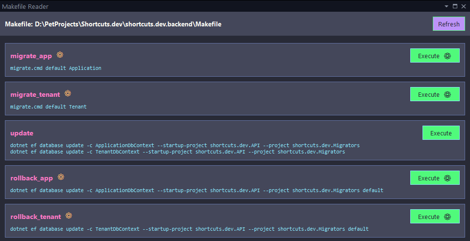
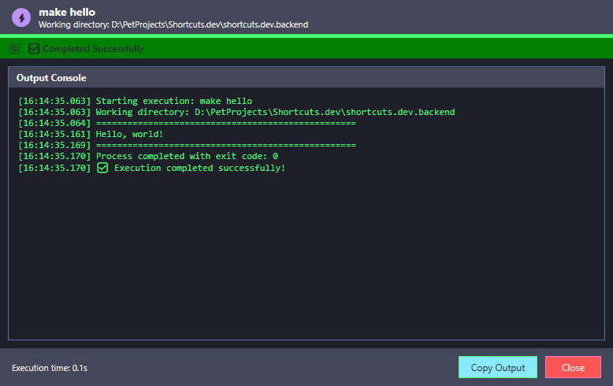
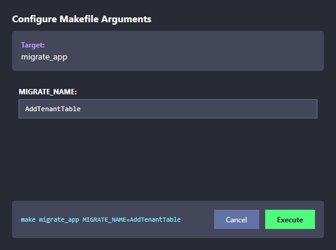

<h1>
  
  MakefileReader
</h1>

A powerful Visual Studio extension for reading, parsing, and executing Makefile targets with full argument support. Experience seamless Makefile integration with an intuitive interface, real-time execution tracking, and automatic variable handling.

## Screen Shots

### Homepage

<div align="center">
  
  <br>
  <em></em>
</div>

### Execute Window

<div align="center">
  
  <br>
  <em></em>
</div>

### Argument Window

<div align="center">
  
  <br>
  <em></em>
</div>

## Features

### 📋 Makefile Tool Window
- **Dedicated Tool Window**: Clean, organized interface for viewing and managing Makefile targets
- **Quick Access**: Open with `Ctrl+Alt+1` or via `View > Other Windows > Makefile`
- **Smart Parsing**: Automatically detects all available Makefile targets with dependencies
- **Argument Detection**: Identifies targets requiring variables with visual indicators
- **One-Click Execution**: Execute any target with intelligent argument handling

### 🎯 Smart Argument Support
- **⚙️ Visual Indicators**: Gear icons show which targets require arguments
- **Argument Input Dialog**: Professional dialog for entering variable values
- **Default Value Pre-population**: Automatically loads default values from Makefile
- **Live Command Preview**: Shows the exact command being executed
- **Variable Detection**: Supports `$(VARIABLE)` and `${VARIABLE}` syntax
- **Keyboard Navigation**: Enter to execute, Escape to cancel

### 🎨 Modern UI Design
- **Dracula Theme**: Beautiful dark theme with purple, cyan, and green accents
- **Responsive Layout**: Clean, modern interface that adapts to your workflow
- **Visual Feedback**: Clear status indicators and progress visualization
- **Tooltip Support**: Helpful hints and guidance throughout the interface

### ⚡ Advanced Execution Engine
- **Real-Time Output**: Live console output with scrollable, copyable text area
- **Progress Tracking**: Visual progress bar with execution time display
- **Process Management**: Graceful process termination and cleanup
- **Working Directory Detection**: Automatic detection based on Makefile location
- **Copy to Clipboard**: Easy copy functionality for command output
- **Error Handling**: Clear error messages and status reporting

### 🔧 Context Menu Integration
- **Right-Click Preview**: Right-click any file and select "Preview Makefile"
- **Smart Validation**: Automatically validates if the selected file is a valid Makefile
- **Universal Access**: Available on all files with intelligent file type detection
- **Error Handling**: Clear error messages for non-Makefile files

## 📦 Installation

### From VSIX File
1. Download the latest `MakeFileReader.vsix` file from the releases
2. Double-click the VSIX file to install
3. Restart Visual Studio
4. The extension will be available immediately

### From Visual Studio Marketplace
*(Coming soon)*

## 🔧 Usage

### Opening the Makefile Tool Window

**Method 1: Keyboard Shortcut**
- Press `Ctrl+Alt+1` to open the Makefile tool window

**Method 2: Menu Navigation**
- Go to `View > Other Windows > Makefile`

**Method 3: Context Menu**
- Right-click any file in Solution Explorer
- Select "Preview Makefile"
- If it's a valid Makefile, the tool window will open with the file loaded

### Understanding Target Types

**Targets without Arguments** (Simple execution)
```makefile
hello:
	@echo "Hello World!"
```
- Displays as: `hello` with green "Execute" button
- Click executes immediately with confirmation

**Targets with Arguments** (Smart argument handling)
```makefile
migrate_app: ## Add a new migration
	migrate.cmd $(MIGRATE_NAME) Application
```
- Displays as: `migrate_app ⚙️` with "Execute ⚙️" button
- Click opens argument dialog for `MIGRATE_NAME` input

### Executing Makefile Targets

#### For Simple Targets:
1. **Load a Makefile**: Use any of the access methods above
2. **View Targets**: All available targets display in the tool window
3. **Execute**: Click the green "Execute" button
4. **Confirm**: Click "Yes" in the confirmation dialog
5. **Monitor**: Watch real-time output in the execution window

#### For Targets with Arguments:
1. **Identify Argument Targets**: Look for ⚙️ gear icons
2. **Click "Execute ⚙️"**: Opens the argument input dialog
3. **Enter Values**: Fill in required variables (pre-populated with defaults)
4. **Preview Command**: See the exact command that will be executed
5. **Execute**: Click "Execute" to run with your arguments
6. **Monitor Progress**: Watch real-time output and progress

### Working with Variables

**Supported Variable Formats:**
- `$(VARIABLE_NAME)` - Standard make syntax
- `${VARIABLE_NAME}` - Alternative syntax
- `VARIABLE ?= default` - Default value definitions

**Example Makefile:**
```makefile
# Variable definitions
MIGRATE_NAME ?= default
ROLLBACK_NAME ?= default

migrate_app: ## Add a new migration for application db context
	migrate.cmd $(MIGRATE_NAME) Application

rollback_app: ## Rollback application database
	dotnet ef database update $(ROLLBACK_NAME) --startup-project API

update: ## Update all databases
	dotnet ef database update
```

**Result in Extension:**
- `migrate_app ⚙️` - Opens dialog for `MIGRATE_NAME`
- `rollback_app ⚙️` - Opens dialog for `ROLLBACK_NAME`
- `update` - Direct execution (no arguments)

## 🛠️ System Requirements

- **Visual Studio**: 2019 or later (2022 recommended)
- **Operating System**: Windows 10/11
- **Make Tool**: GNU Make or compatible make utility must be installed and available in PATH
- **.NET Framework**: 4.8 or later

## 📁 Project Architecture

```
MakefileReader/
├── Commands/                     # Command handlers
│   ├── OpenMakefileToolWindowCommand.cs
│   └── PreviewMakefileCommand.cs
├── Parser/                       # Makefile parsing engine
│   └── MakefileParser.cs
├── Widgets/                      # UI components
│   ├── MakefileToolWindowControl.xaml(.cs)
│   ├── MakeExecutionWindow.xaml(.cs)
│   └── ArgumentInputDialog.xaml(.cs)
├── Resources/                    # Extension resources
│   └── Icon.png
├── VSCommandTable.vsct          # Visual Studio command table
└── source.extension.vsixmanifest # Extension manifest
```

## 🎨 UI Components

### Main Tool Window
- **Target List**: Displays all parsed Makefile targets with visual indicators
- **Execute Buttons**: Context-aware execution (simple vs. argument-based)
- **Command Preview**: Shows actual commands for each target
- **Status Display**: Current file and parsing status
- **Refresh Button**: Reload current Makefile

### Argument Input Dialog
- **Dynamic Form**: Creates input fields for each required variable
- **Default Values**: Pre-populates with Makefile-defined defaults
- **Live Preview**: Shows the final command as you type
- **Validation**: Ensures all required fields are completed
- **Keyboard Support**: Full keyboard navigation and shortcuts

### Execution Window
- **Progress Bar**: Real-time progress indication
- **Status Banner**: Current execution status with color-coded indicators
- **Output Console**: Live, scrollable, copyable command output
- **Action Buttons**: Copy output and close window functionality
- **Execution Timer**: Real-time duration tracking
- **Process Control**: Safe termination of running processes

## 🔍 Makefile Parsing Engine

### Advanced Parsing Features
- **Target Detection**: Identifies all make targets and their dependencies
- **Variable Extraction**: Finds `$(VAR)` and `${VAR}` references before expansion
- **Default Value Handling**: Reads `VAR ?= default` definitions
- **Command Preprocessing**: Maintains original commands for variable detection
- **Special Target Filtering**: Ignores `.PHONY`, `.DEFAULT`, etc.
- **Multi-line Support**: Handles line continuations and complex targets

### Supported Makefile Syntax
- Standard GNU Make syntax
- Target dependencies and prerequisites
- Variable definitions and expansions
- Comment-based documentation
- Multi-line commands with backslash continuation
- Conditional assignments (`?=`, `:=`, `+=`)

## 🚨 Error Handling & Validation

- **File Type Validation**: "Incompatibility file. File must be Makefile" for invalid files
- **Parse Error Recovery**: Graceful handling of malformed Makefiles
- **Execution Error Display**: Detailed error output in execution window
- **Process Cleanup**: Automatic cleanup of running processes on exit
- **Network Error Handling**: Robust handling of network-dependent make operations
- **Permission Error Detection**: Clear messages for permission-related failures

## 🎯 Advanced Features

### Performance Optimizations
- **Lazy Loading**: Tool window content loaded on demand
- **Background Processing**: File parsing on background threads
- **UI Virtualization**: Efficient handling of large Makefile target lists
- **Memory Management**: Proper disposal of processes and resources
- **Caching**: Intelligent caching of parsed Makefile data

### Development Features
- **Debug Support**: Comprehensive logging and error reporting
- **Extension Points**: Modular architecture for future enhancements
- **Theme Support**: Easy customization of color schemes
- **Localization Ready**: Architecture supports multiple languages

## 🤝 Contributing

We welcome contributions! Please feel free to submit issues, feature requests, or pull requests.

### Development Setup
1. Clone the repository
2. Open `MakefileReader.sln` in Visual Studio 2022
3. Install VSSDK workload if not already installed
4. Build the solution (`Ctrl+Shift+B`)
5. Press F5 to launch the Experimental Instance

### Debugging
- Use the Experimental Instance for testing
- Set breakpoints in your code
- Use the Output Window for debugging information
- Test with various Makefile formats

## 📝 License

This project is licensed under the MIT License - see the LICENSE file for details.

## 🔗 Links

- [Visual Studio Marketplace](link-coming-soon)
- [GitHub Repository](https://github.com/your-username/MakefileReader)
- [Issue Tracker](https://github.com/your-username/MakefileReader/issues)
- [Documentation](https://github.com/your-username/MakefileReader/wiki)

## 📞 Support

If you encounter any issues or have questions:

1. **Check Documentation**: Review this README and the wiki
2. **Search Issues**: Look through existing GitHub issues
3. **Create New Issue**: Include Visual Studio version, extension version, and sample Makefile
4. **Provide Context**: Include error messages, screenshots, and steps to reproduce

### Common Issues
- **Make not found**: Ensure GNU Make is installed and in your PATH
- **Permission errors**: Run Visual Studio as Administrator if needed
- **Large Makefiles**: Performance may vary with very large Makefile projects
- **Complex syntax**: Some advanced Make features may not be fully supported

---

**Transform your Makefile workflow!** 🛠️ Experience the power of integrated Makefile execution with intelligent argument handling and real-time feedback.